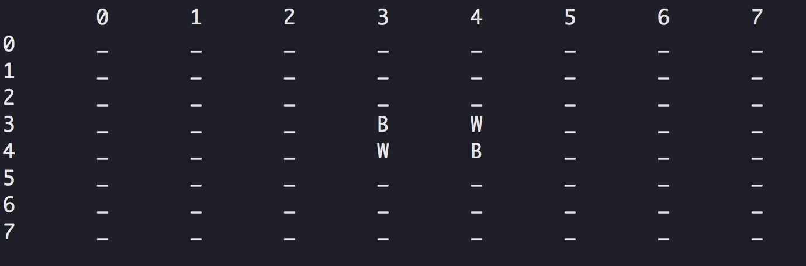

# Game Engine
The aim of this project is designing a board game engine in order to manage a board with one or more players, a clock per player if needed, one or more pieces from one or more different types with an abstract strategy to define the game.

# Engine Goals

1. Board is a 2-Dimensional array of cells with any shape (it may be hexagon). 
2. Each cell may be temporarily or permanently disabled or enabled as an empty cell or containing one or more pieces.
3. A piece may belong to a determined player as a special case in which all players play with all pieces.
4. Players play one by one (not simultaneously) with the order of playing determined by the strategy. It may be a static or dynamic order (For example playing in Chess is static but in some other games the next player may be determined based on the move of the previous player and the state of the board). 
5. Each player plays regardless or by considering one or more random integer generators (for example, one or two dices may be used as random generators with only 6 valid integers 1, 2, ..., 6). Strategy defines (by a checker) validation of a move or chain of moves.
6.  A “move” may be moving or even inserting, removing or changing the type of one or more pieces.
7.   Conditions of the final state and the zero, one or more winners are also determined by the strategy of the game considering the state of the board, turn of playing, clocks and ... .
# Othello
In this project, the Othello game is designed by use of this engine. The Othello game is executed due to polymorphism by inheritance from engine classes and overriding techniques. This engine and associated game are implemented in C++.

## AI 😎
In this game by using the [Minimax algorithm](https://www.geeksforgeeks.org/minimax-algorithm-in-game-theory-set-1-introduction/), the computer can find the optimal move, assuming that you also play optimally.

## Dependencies
* This project needs a C++ compiler.

## How it works
1. Clone the repository
2. Run <code>$ make</code>
4. Run the executable <code>othello</code>

### Todo
----------
- [x]  Design a proper Graphical User Interface in JAVA for the game to support all elements described above in addition of some options for initializing, saving, loading or... .
- [ ]  Connect C++ and Java with JNI

